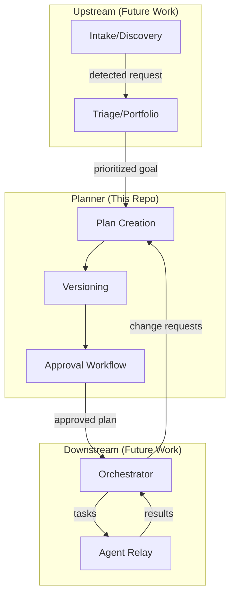
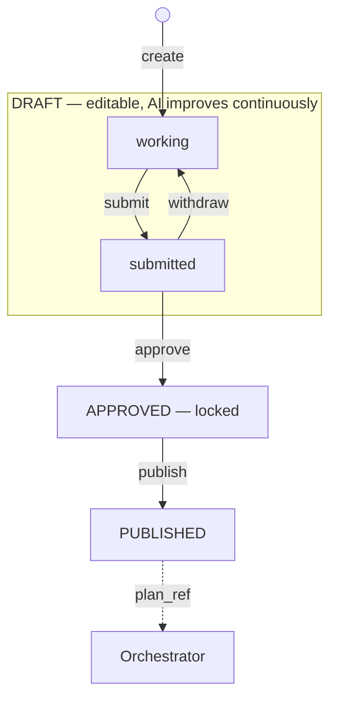

# Planner Core: Vision & Architecture

## Overview

Planner is the **source of truth for intent** in an agentic AI system. It transforms goals into structured, versioned, approvable plans that can be executed by any orchestration framework.

```
┌──────────────────┐     ┌──────────────────┐     ┌──────────────────┐
│                  │     │                  │     │                  │
│  Intake/Portfolio│────▶│     PLANNER      │────▶│   Orchestrator   │
│    (upstream)    │     │    (this repo)   │     │   (downstream)   │
│                  │     │                  │     │                  │
└──────────────────┘     └──────────────────┘     └──────────────────┘
       goals                   plans                  execution
```

**Planner does one thing well**: it takes a goal and produces a versioned, reviewable, approvable specification for execution. It spawns planning agents (via Relay) to help draft plans, but doesn't execute plans or manage implementation—it produces the contract that other systems consume.

---

## The Problem

When building agentic AI systems, there's a gap between "what we want to achieve" and "how agents execute it":

- **No structured planning layer** — Goals go directly to execution with no review or approval
- **No versioning** — Plans change mid-execution, creating "moving target" problems
- **No human oversight** — Agents act autonomously without approval gates
- **Framework lock-in** — Plans are tied to specific orchestration tools (LangGraph, CrewAI, Temporal)

Planner solves this by providing a **universal plan format** with built-in versioning and approval workflows.

---

## Where Planner Fits

### The Three-Layer Architecture



### Layer Responsibilities

| Layer | Responsibility | Examples/Candidates |
|-------|---------------|---------------------|
| **Intake/Discovery** | Monitor channels (Slack, email, GitHub), detect requests, route to Portfolio/Planner | Custom, Linear webhooks |
| **Triage/Portfolio** | Prioritize and sequence initiatives | Custom, WSJF-based |
| **Planner** | Accept any expression of intent, help refine, produce versioned plans | **This repo** |
| **Orchestrator** | Execute approved plans, dispatch to agents | LangGraph, CrewAI, Temporal |
| **Agent Relay** | Agent-to-agent messaging and coordination | Existing relay infrastructure |

### Integration Points

**Planner Input Contract:**

Planner accepts any expression of intent—from vague ideas to detailed specs. The AI helps refine vague input into structured plans.

```typescript
interface PlanInput {
  goal: string;              // Required - can be vague or specific
  context?: string;          // Background, constraints
  source?: {                 // Where this came from (if routed from Intake)
    channel: 'slack' | 'email' | 'github' | 'direct';
    reference?: string;
  };
  attachments?: {            // Supporting material
    type: 'prd' | 'spec' | 'design' | 'document';
    content: string;
  }[];
}
```

**Examples of valid input:**
- `{ goal: "improve user experience" }` — vague, AI helps scope
- `{ goal: "add dark mode toggle" }` — specific, AI drafts plan
- `{ goal: "implement auth", attachments: [spec] }` — detailed, AI uses spec

**Upstream → Planner:**
```
POST /plans
{
  goal: "Implement dark mode for the application",
  context: "Must work on mobile and desktop"
}
```

**Planner → Downstream:**
```
GET /plans/{id}  →  Returns approved PlanVersion (JSON)
```

**Downstream → Planner (feedback loop):**
```
POST /plans/{id}/change-requests
{
  reason: "Missing database migration step",
  suggested_changes: { add_steps: [...] }
}
```

---

## Core Concepts

### PlanVersion

The central artifact Planner produces:

```typescript
interface PlanVersion {
  plan_id: string;
  version: number;
  status: 'draft' | 'approved' | 'published';

  summary: {
    goal: string;
    context?: string;
  };

  steps: Step[];

  created_at: string;
  updated_at: string;
}
```

### Step

Individual units of work in a plan:

```typescript
interface Step {
  step_id: string;
  title: string;

  // AI-inferred, not user-specified (displayed but rarely edited)
  dependencies: string[];

  // Scope context (which repo/team/domain this step belongs to)
  scope?: string;

  // What humans care about
  description?: string;
  owner_role?: string;
  acceptance_criteria?: AcceptanceCriterion[];
  gate?: {
    type: 'human_approval';
    approver_role?: string;
  };

  // For nested complexity (sub-plan reference)
  sub_plan_id?: string;
}
```

**Key points:**
- Dependencies are AI-inferred from step descriptions and context
- Humans express intent ("X before Y"), AI builds the DAG
- Scopes group steps by repo/team/domain
- Most plans are multi-scope (real work crosses boundaries)

See [planner-scale.md](./planner-scale.md) for handling multi-scope and hierarchical plans.

### Plan Lifecycle



**Three states + submitted flag**:
- `draft` = editable (working or submitted for review)
- `approved` = locked, immutable
- `published` = released to orchestrator

**Submit vs Approve**:
- **Submit**: Coordination signal ("I'm ready for review") - plan stays editable
- **Approve**: Accountability checkpoint ("I sign off") - plan becomes immutable

**Key invariant**: Approved and published versions are **immutable**. Any change creates a new version.

---

## What Planner Does

### Core Capabilities

1. **Accept Any Intent** — From vague ideas to detailed specs
2. **Refine & Scope** — AI helps brainstorm, clarify, and structure
3. **Plan Creation** — Produce multi-scope plans with AI-inferred dependencies
4. **Versioning** — Track every meaningful change with structural diffs
5. **Approval Workflow** — Manage draft → approved → published lifecycle
6. **Validation** — Ensure plans are structurally sound (acyclic DAG, valid references)
7. **Export** — Produce canonical JSON for orchestrators, Markdown for humans

### What Planner Does NOT Do

- ❌ Execute plans or spawn implementation agents
- ❌ Manage retries, timeouts, or concurrency
- ❌ Dispatch tasks to agents (that's Orchestrator)
- ❌ Prioritize between plans (that's Portfolio)
- ❌ Monitor channels for requests (that's Intake)

---

## API Surface

### REST Endpoints

```
# Plan CRUD
POST   /plans                         # Create new plan
GET    /plans/{id}                    # Get latest version
GET    /plans/{id}/versions           # List all versions
GET    /plans/{id}/versions/{v}       # Get specific version
PUT    /plans/{id}                    # Update (creates new version)

# Workflow
POST   /plans/{id}/submit             # Signal ready for review (to Portfolio/reviewers)
POST   /plans/{id}/approve            # Approve and lock plan
POST   /plans/{id}/publish            # Publish for execution

# Orchestrator Integration
POST   /plans/{id}/change-requests    # Request plan modification
POST   /plans/{id}/runs/{run}/status  # Push execution status (optional)
```

### Orchestrator-Agnostic Format

The plan format is designed to work with any orchestration framework:

| Plan Element | LangGraph | CrewAI | Temporal | Airflow |
|--------------|-----------|--------|----------|---------|
| `step_id` | Node ID | Task ID | Activity ID | Task ID |
| `dependencies` | Graph edges | `context` | Code flow | `>>` operator |
| `owner_role` | — | Agent role | Worker queue | — |
| `acceptance_criteria` | Output check | Expected output | Result check | Sensor |
| `gate` | Breakpoint | `human_input` | Signal/wait | External sensor |

Each orchestrator translates the universal format into its native execution model.

---

## Technology Candidates

| Concern | Candidates | Notes |
|---------|------------|-------|
| Language | TypeScript | Consistency with existing tooling |
| Runtime | Node.js 20+ | LTS, good async support |
| Storage | SQLite → PostgreSQL | Start simple, scale later |
| API | REST + JSON | Universal, orchestrator-friendly |
| Validation | Zod | Runtime type checking |
| Testing | Vitest | Fast, TypeScript-native |

---

## Design Principles

1. **Do One Thing Well** — Planner plans. It doesn't execute.

2. **Immutability After Approval** — Approved plans are contracts. Changes create new versions.

3. **Roles Over Agents** — Plans specify `owner_role: "backend:Coder"`, not specific agent IDs.

4. **Human-in-the-Loop by Default** — Gates and approval workflows are first-class.

5. **Orchestrator-Agnostic** — Any execution framework can consume the plan format.

---

## Open Questions

- [ ] **Decomposition methods**: Should Planner support a "methods library" for common task decompositions (HTN-style)?
- [x] **AI-assisted planning**: Yes — Planner spawns planning agents via Relay. Agents use MCP tools to read/write plan state. AI helps brainstorm, refine vague input, generate steps, and infer dependencies.
- [ ] **Run overlay**: Should Planner display execution status from orchestrators, or stay purely plan-focused?
- [ ] **Template support**: Should Planner support reusable plan templates?

---

## Relationship to Existing Infrastructure

Planner is designed to integrate with:

- **Agent Relay** — Planner spawns planning agents via Relay; agents use MCP tools to read/write plan state
- **Future Orchestrator** — Fetches approved plans, spawns implementation agents via Relay
- **Future Intake** — Monitors channels, routes detected requests to Planner
- **Future Portfolio** — Prioritizes initiatives, decides what gets planned when

The plan format serves as the **contract** between these layers. Planner owns the contract; other systems produce or consume it.

---

## Summary

**Planner is the source of truth for intent.**

It's where humans and agents agree on what should happen, tracked with full version history and approval gates. Everything else—relay, orchestrator, agents—exists to make the plan happen. But the plan itself is the contract.
